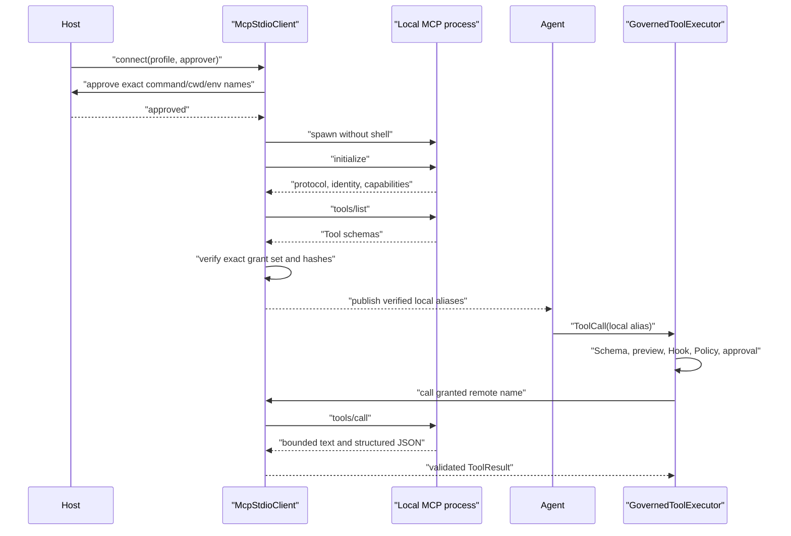

# Governed MCP Stdio

## Purpose

M5b connects explicitly approved local MCP servers without allowing MCP discovery to create Agent
authority. It supports one transport and one server feature:

- direct local `stdio`;
- MCP Tools.

It uses the official stable Python SDK `mcp>=1.28.1,<2` and protocol `2025-11-25`. Streamable
HTTP, SSE, OAuth, Resources, Prompts, Roots, Sampling, Elicitation, Tasks, server instructions,
dynamic Tool refresh, automatic retry, and package installation are outside this release.

## Two Authority Decisions

Starting an MCP server and calling one of its Tools are different decisions:

1. **Connection approval** authorizes one exact local executable/argv/cwd/environment-name set to
   start with the Agent user's operating-system privileges.
2. **Tool governance** evaluates one validated `ToolCall` through ActionPreview, Hooks, Policy,
   and optional Tool approval.

Connection approval never means every Tool call is approved.



## Host-Pinned Profile

`McpServerProfile` is trusted composition data. It is never loaded from a repository, Skill,
model response, server response, registry, or discovered configuration file.

The profile pins:

- stable `server_id`;
- absolute existing executable regular-file path;
- exact argument tuple;
- absolute existing unlinked working directory;
- up to 32 explicit environment keys with `SecretStr` values;
- exact protocol, server name, and server version;
- one to 32 `McpToolGrant` records;
- startup, listing, call, close, schema, Tool-count, text, JSON, and result limits.

The executable and cwd are checked at model construction and revalidated immediately before
process creation. Links, Windows reparse points, relative paths, missing paths, non-regular
executables, and non-executable files fail closed. Argument tokens are passed as data; no command
string, shell expansion, PATH resolution, or URL opener is used.

Environment values remain `SecretStr`. Approval exposes only sorted key names. The official SDK
adds its small platform-default environment allowlist and the explicit profile values.

## Exact Tool Contracts

Every `McpToolGrant` binds:

- exact case-sensitive remote name;
- bounded local Agent alias;
- host-owned model-facing description;
- host-owned `SideEffect` and `RiskLevel`;
- canonical input-schema SHA-256;
- optional canonical output-schema SHA-256.

Server title, description, icons, annotations, metadata, instructions, and destructive/read-only
hints are ignored. They cannot change Policy authority or model-facing definitions.

After initialization, the client requires:

- exact protocol version;
- exact server name/version;
- Tools capability;
- `tools.listChanged` disabled;
- one non-paginated Tool page;
- unique observed names;
- exact equality between observed Tool names and grants;
- valid bounded JSON Schemas with matching canonical hashes;
- no task-required Tool.

One missing, unexpected, duplicate, renamed, paginated, or drifted Tool rejects the entire
connection. No partial Registry is published.

Canonical hashes use sorted-key compact ASCII JSON with non-finite numbers rejected. A hash proves
equality with the reviewed contract, not code provenance or safe behavior.

## SDK and Process Lifecycle

The production `OfficialStdioSessionFactory` keeps `stdio_client` and `ClientSession` inside a
dedicated asyncio owner worker. This is required because the SDK's AnyIO contexts must exit in the
task that entered them. Public calls can originate in another task; `aclose()` signals the worker,
which performs protocol transport shutdown and process-tree cleanup in the owner task.

```text
new -> approving -> connecting -> verifying -> ready -> closing -> closed
                         \---------- failure ----------/
```

`McpStdioClient` is single-use. Calls are serialized and never retried. Startup, initialize,
listing, call, and close have separate deadlines. A timeout, cancellation, or raw transport
failure closes the session and makes later calls unavailable.

For a read-only timeout the public code is `mcp_tool_timeout`. For WRITE, EXECUTE, or NETWORK,
timeout returns `mcp_tool_completion_unknown`: cancellation stops waiting but cannot prove the
remote side effect did not happen.

Server stderr goes to `os.devnull`. This prevents unbounded log capture and secret propagation but
reduces diagnostics.

## Result Boundary

The SDK adapter accepts only:

- ordered text blocks;
- optional object-shaped `structuredContent`;
- `isError`.

Image, audio, resource-link, embedded-resource, and unknown content reject the entire result.
Annotations and `_meta` are not retained. Global SDK snapshot ceilings apply before profile-level
limits.

`McpTool` then enforces:

- block count and aggregate text characters;
- total UTF-8 result bytes;
- JSON depth and node count;
- string/key bounds and finite numbers;
- granted output schema for successful results.

Remote business errors keep bounded text and `is_error=true` so the model can correct arguments.
Oversized or unsupported data is never truncated into success.

The final model-visible shape is deterministic:

```json
{
  "content_type": "mcp_tool_result",
  "server_id": "local-git",
  "structured_content": {"clean": true},
  "text": ["clean"],
  "tool": "status"
}
```

## Governance Composition

```python
from mini_code_agent.mcp import McpStdioClient, build_mcp_tools
from mini_code_agent.policy import GovernedToolExecutor, TrustSource
from mini_code_agent.tools import ToolRegistry

async with McpStdioClient(profile, approver=connection_approver) as client:
    mcp_tools = build_mcp_tools(client)
    all_tools = (*native_tools, *mcp_tools)
    executor = GovernedToolExecutor(
        ToolRegistry(all_tools),
        policy=policy,
        approval=tool_approval,
        session_mode=session_mode,
        trust_source=TrustSource.MODEL,
        trust_sources={
            tool.definition.name: TrustSource.EXTENSION
            for tool in mcp_tools
        },
    )
    result = await agent_runtime(provider, executor).run(
        user_prompt="Inspect the project."
    )
```

Per-Tool provenance is copied at executor construction. Unknown mapping keys and non-enum values
are rejected. MCP ActionPreview resources use
`mcp://<server_id>/tools/<remote_name>` and host-selected risk/side effect.

## Failure Matrix

| Boundary | Failure | Public outcome |
|---|---|---|
| Approval | deny, timeout, exception, malformed result | no process; `connection_not_approved` |
| Launch path | relative, missing, linked, reparse, replaced | no process; `connection_failed` |
| Initialize | timeout, protocol/identity mismatch, no Tools | close; typed connection error |
| Tool list | pagination, dynamic flag, extra/missing/duplicate Tool | close; no definitions |
| Schema | invalid, oversized, hash drift | close; no definitions |
| Policy | deny or rejected ask | no remote Tool call; `permission_denied` |
| Remote call | timeout/transport failure | close; timeout or completion unknown |
| Result | unsupported, invalid, oversized, schema mismatch | static Tool error; no partial content |
| Close | budget or SDK failure | `close_failed`; client is unusable |

## Operational Verification

The real integration fixture uses the official low-level SDK over stdio. It proves:

- exact handshake, identity, schemas, call, structured output, and shutdown;
- connection approval projection excludes environment values;
- `TrustSource.EXTENSION` Policy deny prevents a remote call;
- Tool ASK remains independent from connection approval;
- an extra Tool or changed schema admits no definitions;
- the official session can close from a different caller task without leaking a Windows transport.

## Threat Boundary and Non-Claims

- MCP is interoperability, not a sandbox or trust protocol.
- A local server can execute arbitrary code during startup before any Tool call.
- `stdio` restricts protocol access to the child pipes; it does not restrict filesystem, network,
  process, or credential access available to the child.
- Approval displays the launch facts; it does not make an executable safe.
- Host `READ_ONLY` is an assertion about intended behavior, not enforcement inside server code.
- Schema hashes detect contract drift, not implementation drift, package substitution, or
  malicious behavior behind the same schema.
- Revalidating paths narrows ordinary TOCTOU but cannot make process launch atomic with file
  identity on every operating system.
- Timeout and process cleanup cannot roll back a side effect.
- M5b does not verify executable signatures or argument-file hashes and does not install packages.
- M5b does not implement remote MCP, OAuth, Resources, Prompts, Roots, Sampling, Elicitation,
  Tasks, dynamic Tool updates, retries, durable MCP lifecycle audit, or OS isolation.

The lifecycle and Tool behavior align with the official
[MCP lifecycle specification](https://modelcontextprotocol.io/specification/2025-11-25/basic/lifecycle),
[MCP Tools specification](https://modelcontextprotocol.io/specification/2025-11-25/server/tools),
[security guidance](https://modelcontextprotocol.io/docs/tutorials/security/security_best_practices),
and [Python SDK v1 client documentation](https://github.com/modelcontextprotocol/python-sdk/blob/v1.x/docs/client.md).

