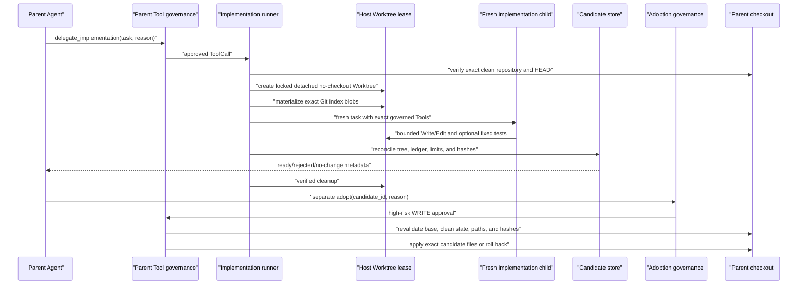
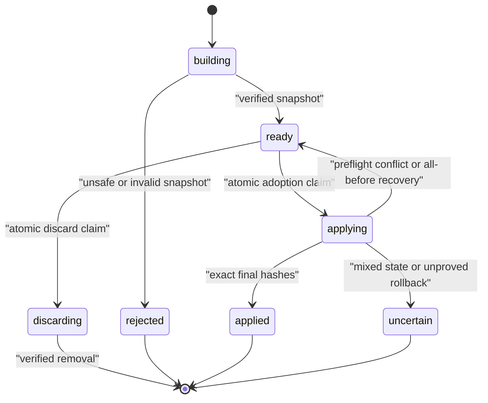

# Governed Worktree Candidates

## Purpose and Scope

M6b lets a parent Agent delegate one bounded implementation task without allowing the child to
write into the parent checkout. The host creates a locked Git Worktree lease from an exact clean
base, runs one implementation Subagent inside that lease, persists an independently verified
candidate, removes the lease, and exposes adoption as a separate high-risk WRITE Tool.

The first release supports:

- one implementation child per `delegate_implementation` ToolCall;
- host-pinned repository, state root, Git executable, path prefixes, child profile, and limits;
- additions and modifications of regular UTF-8 files with modes `100644` or `100755`;
- optional host-fixed `run_tests` in addition to Read/Search/Write/Edit;
- content-addressed candidate blobs and immutable manifests;
- explicit adoption or discard of a verified ready candidate.

It does not support deletion, rename, arbitrary command/Git/MCP/network access, recursive
delegation, stage/commit/merge/push, automatic adoption, or editing an already dirty parent.

## Authority and Data Flow

The trusted host owns `WorktreeProfile`, Provider and Tool factories, state storage, Git
executable, policy, approval, and every hard limit. The parent model supplies only `task` and
`reason`. The implementation child receives an exact non-interactive Tool profile and cannot
select its repository, capabilities, test command, candidate paths, or adoption policy.



Child completion and parent adoption are deliberately separate authority decisions. A child can
produce evidence that a change exists; it cannot authorize that change to mutate the user's
checkout.

## Host Profile and Limits

`WorktreeProfile` is immutable composition data. It requires absolute, existing, unlinked paths
for the repository, state root, and Git executable. The state root cannot overlap the repository.
Allowed path prefixes are normalized and case-insensitively unique. The embedded
`SubagentProfile` must use implementation mode.

Default limits are:

| Resource | Default | Hard model ceiling |
|---|---:|---:|
| Active leases | 2 | 4 |
| Tracked base files | 10,000 | 20,000 |
| Tracked base bytes | 256 MiB | 1 GiB |
| Tracked path depth | 32 | 64 |
| Candidate files | 32 | 128 |
| Candidate after-content | 2 MiB | 16 MiB |
| One candidate file | 1 MiB | 8 MiB |
| Relative path | 1,024 characters | 1,024 characters |
| Returned diff | 32 KiB | 64 KiB |
| Cleanup deadline | 30 seconds | 300 seconds |

These are admission limits, not performance claims.

## Lease Creation and Materialization

`WorktreeManager` first verifies that the configured root is the exact non-bare repository,
captures `HEAD`, requires a fully clean status, reads NUL-delimited index pointers, and reads raw
objects through `git cat-file --batch`. It rechecks `HEAD` and status after object acquisition.

The host creates the lease with:

```text
git worktree add --detach --no-checkout --lock --reason <lease-id> <path> <base>
```

No checkout filters, hooks, smudge processes, or working-tree conversion are used to populate
files. `materialize_index()` writes only regular `100644`/`100755` index entries from verified
object bytes, enforces all path/file/tree budgets, rejects aliases and links, and records an
immutable base manifest. The exact Worktree administrative directory is persisted and rechecked
during cleanup.

The initial release accepts Git SHA-1 object identifiers only. Repositories using another object
format fail closed.

## Child Capability and Mutation Ledger

The child gets a fresh context and a new `AgentRuntime`. Its exact governed Tool set is host
validated before Provider I/O:

- required Read/Search/Write/Edit Tools;
- optional fixed-profile `run_tests`;
- `TrustSource.SUBAGENT` provenance;
- no Git, arbitrary command, MCP, network, Skill/Hook registration, delegation, or parent approval;
- `SessionMode.NON_INTERACTIVE`, so any `ASK` fails closed.

`LedgerRecordingToolExecutor` records only successful structured `MutationResult` objects from
Write/Edit. Each immutable entry binds ToolCall identity, path, operation, before/after SHA-256,
byte/line counts, and a predecessor hash. Natural-language child output does not create mutation
authority.

## Independent Candidate Snapshot

After the child stops, `CandidateSnapshotter` walks the complete lease tree and reconciles it
against:

1. the immutable Git base manifest;
2. the ordered mutation ledger;
3. the allowed path prefixes;
4. regular-file, mode, UTF-8, path, count, and byte limits;
5. the child status and evidence hash.

A ready candidate contains sorted additions/modifications, bounded unified diffs, before/after
hashes, and content-addressed after-bytes. The manifest has a canonical SHA-256 and is persisted
outside the repository. Unknown changes, deletions, unsupported modes, links, case aliases,
ledger mismatches, invalid content, or budget violations produce a rejected candidate. No changes
produce `no_changes`.

The candidate state machine is:



## Cleanup and Cancellation

Finalization snapshots before cleanup. Cleanup verifies the lease identity, registered Worktree
path, administrative directory, candidate persistence, and either the verified candidate state
or an unchanged base tree. It then unlocks, removes, and prunes through fixed Git argv. If removal
fails after unlock, it attempts to relock and records `cleanup_required`.

External cancellation remains cancellation. Snapshot/cleanup run in a shielded bounded
finalization task; timeout records cleanup-required diagnostics. This avoids silently converting
an interrupted child into success, but it does not make cleanup crash-proof.

## Adoption, Rollback, Recovery, and Discard

`adopt_subagent_candidate` and `discard_subagent_candidate` are separate high-risk WRITE Tools.
Their previews verify the stored manifest and blobs and expose bounded repository/base/path/byte/
diff resources before Policy and approval.

Adoption:

1. atomically claims `ready -> applying`;
2. requires the exact repository, clean status, and original base `HEAD`;
3. preflights every destination and before-hash;
4. stages same-directory temporary files;
5. revalidates every path immediately before the first replacement;
6. applies in canonical path order;
7. verifies the exact changed set and after-hashes;
8. records `applied`, leaving files unstaged and uncommitted.

A preflight conflict writes nothing and returns the candidate to `ready`. An I/O failure rolls
back replacements in reverse order. Proven rollback records `apply_failed_rolled_back`; an
unproved rollback records `uncertain` with recovery evidence.

Interrupted `applying` recovery compares every parent file with before/after hashes:

- all-before becomes `ready`;
- all-after becomes `applied`;
- mixed/unknown becomes `uncertain`.

Discard is allowed only from verified `ready`. Applied, applying, rejected, or uncertain
candidates are never silently deleted.

## Failure Matrix

| Failure | Public outcome | Parent mutation |
|---|---|---|
| Dirty/wrong/bare repository | typed repository error | none |
| Lease or tree budget exceeded | typed limit/materialization error | none |
| Child Tool/profile mismatch | composition failure before Provider I/O | none |
| Child timeout/failure | typed child result, then snapshot/finalize | none |
| Unknown tree mutation or ledger mismatch | rejected candidate | none |
| Snapshot persistence failure | cleanup required | none |
| Cancellation | re-raised after bounded finalization | none |
| Adoption stale base/path/hash | conflict, candidate returns ready | none |
| Adoption I/O failure with proven rollback | rolled back | restored before-state |
| Adoption I/O failure without proof | uncertain plus recovery record | unknown/mixed |
| Cleanup identity/removal failure | cleanup required | none |

## Operational Verification

The M6b test surface includes:

- unit tests for profiles, byte-safe Git, state CAS, materialization, ledger, snapshot,
  finalization, runner, Tools, adoption, discard, rollback, and recovery;
- real-Git integration for no-checkout materialization, child delegation, unchanged parent,
  candidate persistence, adoption, discard, conflict, and cancellation;
- adversarial coverage for hostile names, case/Unicode aliases, links/reparse points, path swaps,
  dirty/changed parent state, stale hashes, output limits, killed Git, lease exhaustion, candidate
  or blob tampering, rollback failure, and cleanup races;
- Python 3.12/3.13 and Windows/Linux CI, strict Pyright, Ruff, coverage, reproducible build, archive
  inspection, and isolated artifact smoke.

Exact counts, CI run IDs, artifact hashes, and release links are recorded only after the release
gate in `docs/learning/progress.md`.

## Threat Boundary and Non-Claims

- A Worktree separates checkout paths; it is not a container, VM, filesystem sandbox, credential
  boundary, network sandbox, or separate OS user.
- In-process Provider/Tool implementations still have the Agent process's memory and OS authority.
- Tool governance constrains calls through the executor; malicious trusted host code can bypass it.
- Git clean/hash checks and immediate revalidation narrow TOCTOU windows but cannot stop another
  process from mutating files between checks and replacement.
- Adoption is process-serialized and rollback-aware, not power-loss atomic, distributed, or a
  database two-phase commit.
- SHA-256 and Git object IDs are equality fingerprints, not signatures, provenance, confidentiality,
  semantic correctness, or proof that tests passed.
- Candidate diffs are bounded presentation evidence; content-addressed blobs are the adoption
  source of truth.
- Child completion does not imply candidate readiness, and candidate readiness does not imply
  approval, correctness, compatibility, or adoption.
- M6b never commits, merges, pushes, resets, cleans, or overwrites a dirty parent checkout.
- No token, latency, cost, quality, or throughput improvement is claimed without a benchmark.
